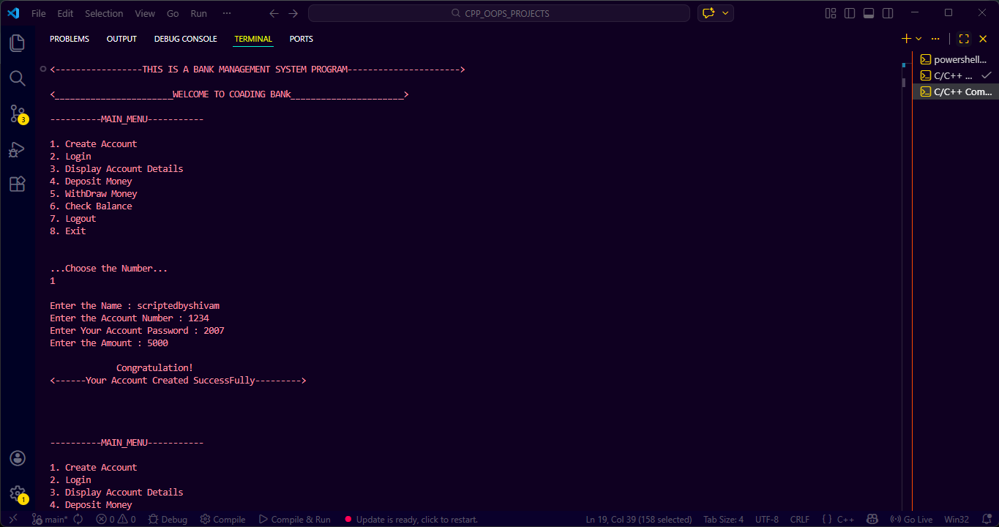
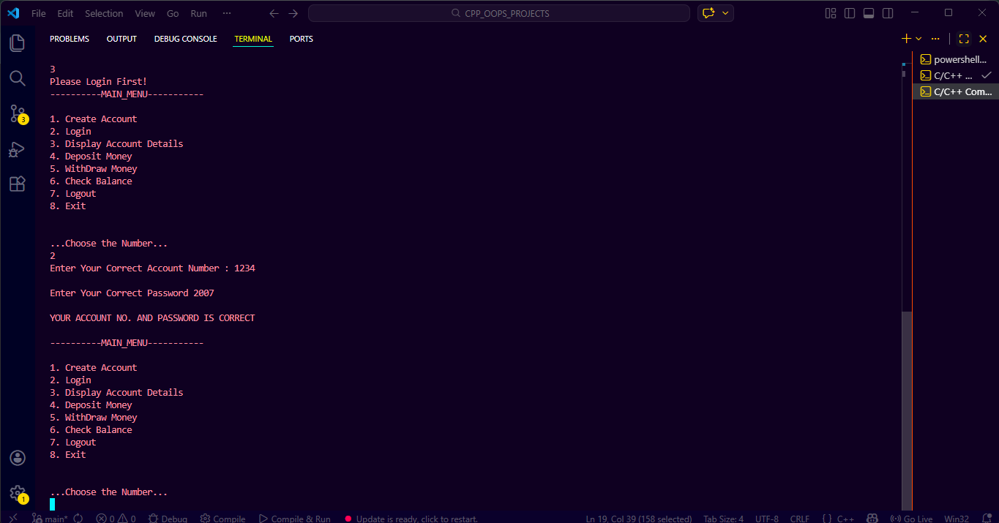
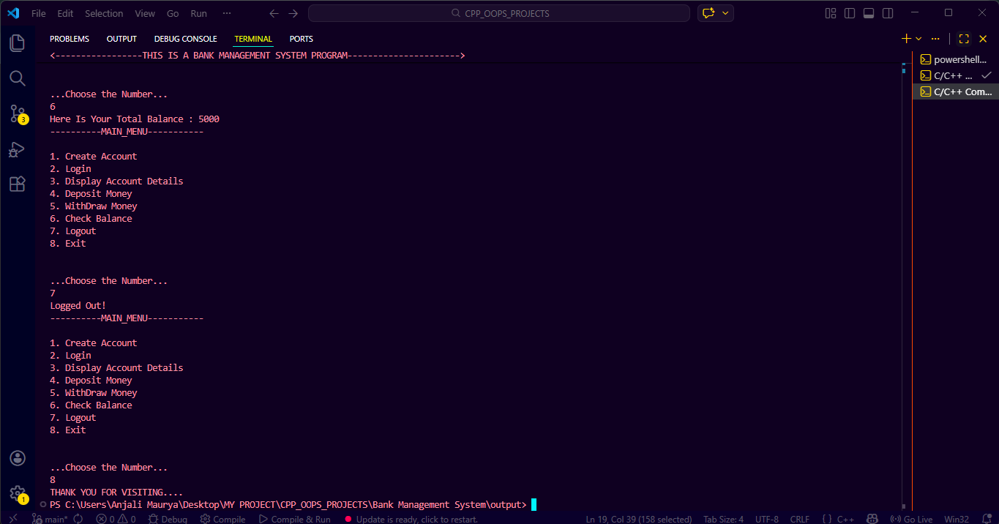
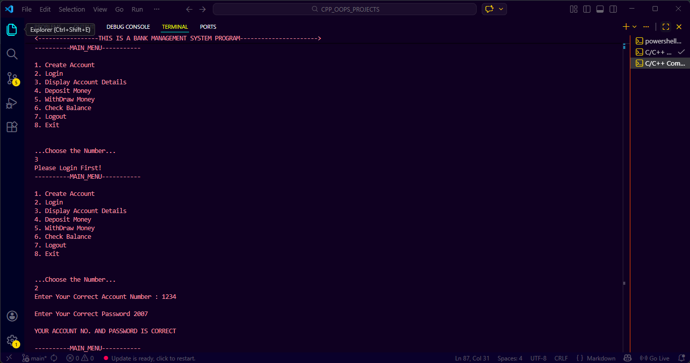

# 🏦 Bank Management System (C++)

A simple **Bank Management System** built using **C++ and Object-Oriented Programming (OOP)** concepts.
This project allows users to create an account, login securely, and perform basic banking operations.

---

## 🚀 Features

* 🆕 Create Account (Minimum ₹500 required)
* 🔐 Login Authentication (Account No. & Password)
* 👤 Display Account Details
* 💰 Deposit Money
* 💸 Withdraw Money (with balance check)
* 📊 Check Balance
* 🔓 Logout System
* ❌ Invalid access protection (Login required)

---

## 🧠 Concepts Used

* Object-Oriented Programming (OOP)

  * Classes & Objects
  * Encapsulation
* Conditional Statements
* Loops (do-while)
* Functions
* Basic Input/Output

---

## 📂 Project Structure

```
Bank-Management-System/
│── Bank Management System.cpp   // Complete source code
│── README.md  // Project documentation
```

---

## 🖥️ How to Run

### 🔹 Using Terminal (Linux / Mac / Windows)

```bash
g++ Bank Management System.cpp -o bank
./bank
```
---
### 🔹 Using IDE

* Open file in VS Code / Dev C++
* Compile and Run

---

## 📸 Sample Menu

```
----------MAIN_MENU-----------

1. Create Account
2. Login
3. Display Account Details
4. Deposit Money
5. Withdraw Money
6. Check Balance
7. Logout
8. Exit
```

---

## 📸 Demo (Screenshots)

<!-- You can later replace these with actual screenshot links -->

<p align="center">
  
  
</p>

<p align="center">
  
  
</p>

<br/>

---

## 🎥 *Live Demo* *(YouTube)*

👉 Watch the full working demo here:
🔗 https://youtu.be/sH3XPfmatpU?si=t01D9FcmfKSGBIWs

---

## ⚠️ Important Notes

* Minimum ₹500 required to create account
* Login is required before accessing features
* Only **single user account** supported
* Data is **not stored permanently** (no file handling yet)


---

## 👨‍💻 Author

**Shivam Maurya**
<br>
B.Tech CSE Student

---

## ⭐ Support

If you like this project, give it a
⭐ on GitHub and feel free to improve it!

---


