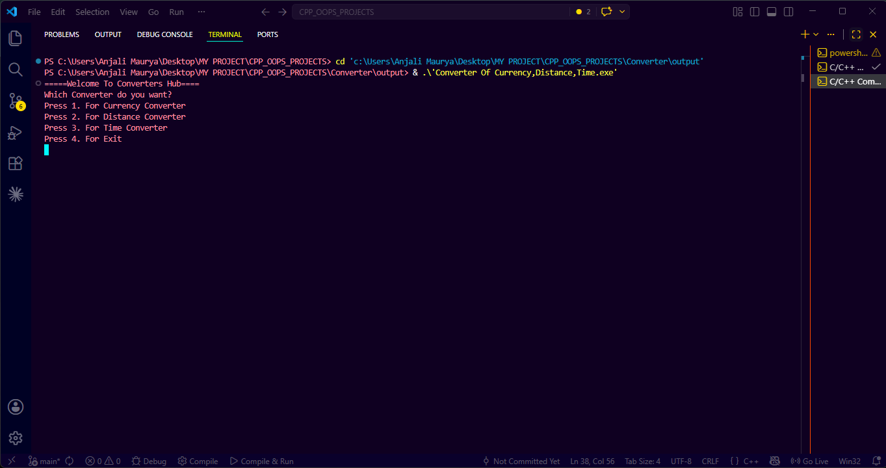
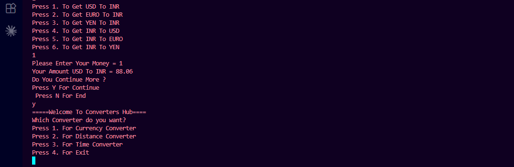
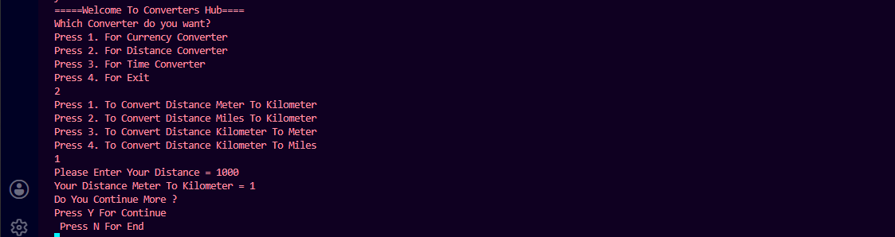
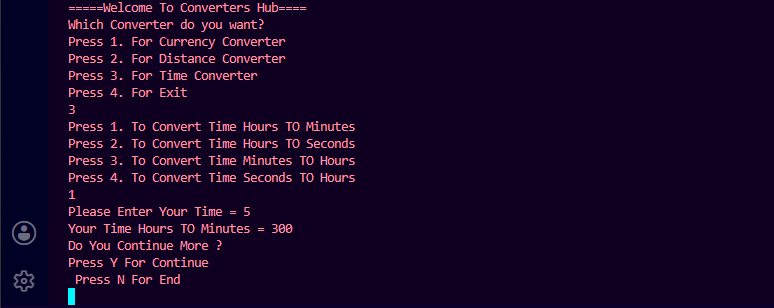

# 🚀 CONVERTERS_HUB

<div align="center">
<pre>

 ██████╗ ██████╗ ███╗   ██╗██╗   ██╗███████╗██████╗ ████████╗███████╗██████╗ 
██╔════╝██╔═══██╗████╗  ██║██║   ██║██╔════╝██╔══██╗╚══██╔══╝██╔════╝██╔══██╗
██║     ██║   ██║██╔██╗ ██║██║   ██║█████╗  ██████╔╝   ██║   █████╗  ██████╔╝
██║     ██║   ██║██║╚██╗██║╚██╗ ██╔╝██╔══╝  ██╔══██╗   ██║   ██╔══╝  ██╔══██╗
╚██████╗╚██████╔╝██║ ╚████║ ╚████╔╝ ███████╗██║  ██║   ██║   ███████╗██║  ██║
 ╚═════╝ ╚═════╝ ╚═╝  ╚═══╝  ╚═══╝  ╚══════╝╚═╝  ╚═╝   ╚═╝   ╚══════╝╚═╝  ╚═╝

</pre>
</div>

---
<a id="top"></a>

<p align="center">
  
</p>

<p align="center">
  A simple and beginner-friendly C++ application for Currency, Distance, and Time conversions.
</p>

<h1 align="center">
  
</h1>

<p align="center">
  
  
  
  
</p>

---

# 📌 About The Project

> 💡 **Converters Hub** is a console-based C++ application developed using Object-Oriented Programming concepts.

This project combines multiple conversion systems into one single application.

### ✨ Included Converters

- 💸 Currency Converter
- 📏 Distance Converter
- ⏰ Time Converter

### 🚀 Project Highlights

- Beginner-friendly project
- Clean and understandable code
- Uses OOP concepts
- Interactive menu-driven interface
- Lightweight and fast execution
- Great for C++ practice and learning

<p align="right"><a href="#top">Back to Top</a></p>

---

# 🌟 Features

<p align="center">
  
  
  
  
</p>

- 💸 Currency conversion system
- 📏 Distance conversion system
- ⏰ Time conversion system
- 🔄 Continuous execution using loops
- 🧠 OOP implementation using classes
- 🎛️ Menu-driven navigation
- ⚡ Fast and lightweight program
- 🧩 Reusable functions and methods
- 🖥️ Console-based interface
- 📚 Educational and beginner-friendly project

<p align="right"><a href="#top">Back to Top</a></p>

---

# 📊 Project Stats

<p align="center">
  
  
  
  
</p>

<p align="right"><a href="#top">Back to Top</a></p>

---

# 🎯 Concepts Used

| Concept | Description | Emoji |
|----------|-------------|-------|
| Classes & Objects | Main building blocks | 🧱 |
| Functions | Reusable code blocks | ⚙️ |
| Switch Case | Menu handling | 🎛️ |
| Loops | Continuous execution | 🔁 |
| Conditional Statements | Decision making | 🎯 |
| Input / Output | User interaction | 💻 |

<p align="right"><a href="#top">Back to Top</a></p>

---

# 💸 Currency Converter

## Supported Conversions

| Conversion | Formula |
|------------|----------|
| USD → INR | USD × 88.06 |
| EURO → INR | EURO × 102.78 |
| YEN → INR | YEN × 0.59 |
| INR → USD | INR ÷ 88.06 |
| INR → EURO | INR ÷ 102.78 |
| INR → YEN | INR ÷ 0.59 |

<p align="right"><a href="#top">Back to Top</a></p>

---

# 📏 Distance Converter

## Supported Conversions

| Conversion | Formula |
|------------|----------|
| Meter → Kilometer | Meter ÷ 1000 |
| Miles → Kilometer | Miles × 1.609 |
| Kilometer → Meter | Kilometer × 1000 |
| Kilometer → Miles | Kilometer ÷ 1.609 |

<p align="right"><a href="#top">Back to Top</a></p>

---

# ⏰ Time Converter

## Supported Conversions

| Conversion | Formula |
|------------|----------|
| Hours → Minutes | Hours × 60 |
| Hours → Seconds | Hours × 3600 |
| Minutes → Hours | Minutes ÷ 60 |
| Seconds → Hours | Seconds ÷ 3600 |

<p align="right"><a href="#top">Back to Top</a></p>

---

# 📂 Project Structure

```bash
Converter/
│
├── Converter Of Currency,Distance,Time.cpp   # Main C++ source file (all converters)
├── Converter Of Currency,Distance,Time.exe   # Compiled executable (if present)
└── README.md                                 # Project documentation
```

**Project Root Structure:**
```bash
CPP_OOPS_PROJECTS/
│
├── Bank Management System/                   # Another C++ OOP project
├── Converter/                               # This Converter project (current)
├── Phone Book Management System/             # Another C++ OOP project
├── output/                                  # Output directory (if used)
└── README.md                                # Workspace/project root documentation
```

### File Descriptions
- **Converter Of Currency,Distance,Time.cpp**: Contains all logic for currency, distance, and time conversions using OOP and menu-driven approach.
- **Converter Of Currency,Distance,Time.exe**: Compiled output (run this after building the project).
- **README.md**: This documentation file.

> All converter logic is implemented in a single C++ file for simplicity and easy navigation.

<p align="right"><a href="#top">Back to Top</a></p>

---

# 🛠️ Technologies Used

<p align="center">
  
</p>

<p align="right"><a href="#top">Back to Top</a></p>

---

# ▶️ How To Run

## 🔹 Clone Repository

```bash
git clone https://github.com/your-username/CONVERTERS_HUB.git
```

---

## 🔹 Open Folder

```bash
cd CONVERTERS_HUB
```

---

## 🔹 Compile Program

```bash
g++ main.cpp -o converter
```

---

## 🔹 Run Program

```bash
./converter
```

<p align="right"><a href="#top">Back to Top</a></p>

---

# 🖼️ Program Screenshots

## 📌 Main Menu

<p align="center">
  
</p>

---

## 💸 Currency Converter Output

<p align="center">
  
</p>

---

## 📏 Distance Converter Output

<p align="center">
  
</p>

---

## ⏰ Time Converter Output

<p align="center">
  
</p>

<p align="right"><a href="#top">Back to Top</a></p>


---

# 🚀 Future Improvements

- 🌡️ Temperature Converter
- ⚖️ Weight Converter
- 🌐 Real-time Currency API
- 🖥️ Better Console UI
- 📁 File Handling
- ✅ Error Handling
- 🎨 GUI Version
- 📱 Cross-platform support

<p align="right"><a href="#top">Back to Top</a></p>

---

# 🤝 Contribution

Contributions and suggestions are welcome.

## Steps To Contribute

1. Fork the repository  
2. Create a new branch  
3. Make your changes  
4. Commit changes  
5. Submit Pull Request  

<p align="right"><a href="#top">Back to Top</a></p>

---

# 👨‍💻 Author

<p align="center">
  <b>Your Name</b><br>
  🎓 CSE Student<br>
  💻 Passionate C++ Developer 🚀
</p>


---

# 🔝 Back To Top

<p align="center">
  <a href="#top">
    
  </a>
</p>

<p align="center">
  🚀 <b>"Practice makes programming stronger every day."</b>
</p>

<p align="center">
  
</p>

