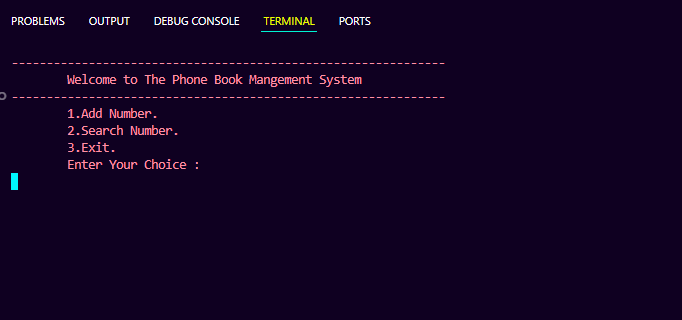
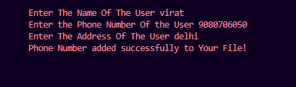
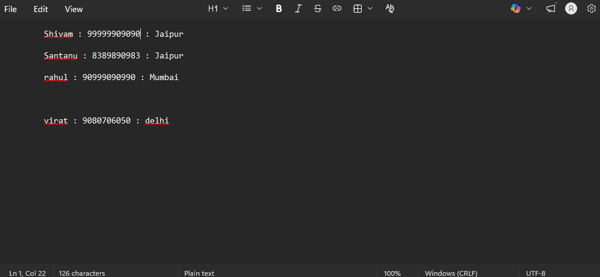
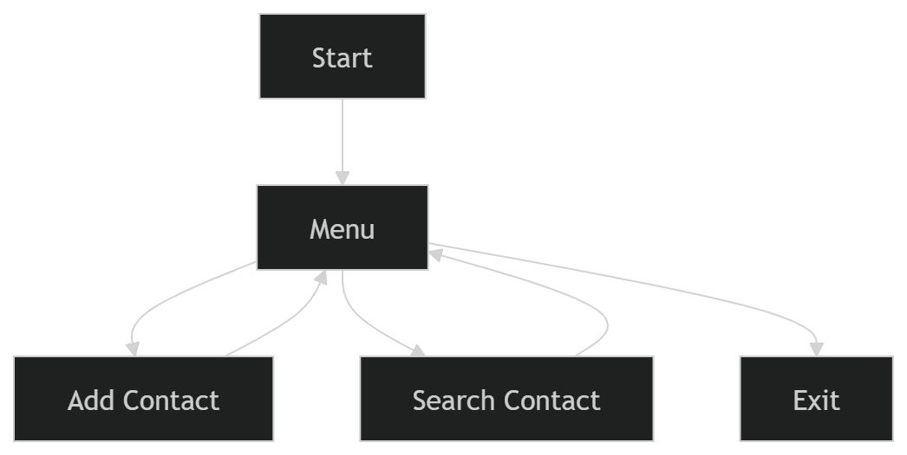

# 📞 Phone Book Management System (C++)

<div align="center">
  
</div>

<p align="center">
  
</p>

---

## 📌 About Project

> 💡 A simple yet powerful **Phone Book Management System** built using **C++ OOP + File Handling**

✨ Features:
- 📞 Add new contacts  
- 🔍 Search existing contacts  
- 💾 Data stored permanently in file  
- ⚡ Fast and simple console interface  

---

## 🎬 Demo (Console Output)

<p align="center">
  
  
</p>

<p align="center">
  
  
</p>

👉 *(Replace this with your real screenshot)*

---

## ⚙️ Features

| Feature | Description | Emoji |
|--------|------------|-------|
| Add Contact | Save name, number, address | ➕ |
| Search Contact | Find user by name | 🔍 |
| File Storage | Data stored in `.txt` file | 💾 |
| Simple UI | Console-based interface | 🖥️ |

---

## 🧠 Concepts Used

- 🧱 Classes & Objects  
- 🔐 Encapsulation  
- 📂 File Handling (`fstream`)  
- 🔄 Loops & Conditions  
- 🧵 StringStream  

---

## 📂 Project Structure

```bash
PhoneBook/
│
├── Phone_Book_Management_System.cpp
├── Phone_Book_Management_System.exe
├── PhoneBook.txt   # Stored data
└── README.md
```
---
## 🚀 Working Flow

<p align="center">
  
</p>

---
## 🎥 *Live Demo* *(YouTube)*

👉 Watch the full working demo here:
🔗 

---
## ⚡ How to Run

### 🔹 Using Terminal (Windows)

```bash
g++ Phone_Book_Management_System.cpp -o phonebook

./phonebook
```

---
## 🌱 Future Improvements

* 🗑️ Delete contact feature

* ✏️ Update contact
* 📱 GUI version (Qt / Web)
* 🔐 Secure file storage

---
## 💡 Why This Project?

* ✔️ Beginner friendly
* ✔️ Real-world use case
* ✔️ Strong OOP + File Handling practice

---
## ⭐ Support

### If you like this project:

* ⭐ Star it
* 🍴 Fork it
* 📢 Share it

---
## 👨‍💻 Author
<p align="center"> <b>Shivam Maurya</b><br> 💻 CSE Student | Developer 🚀 </p>

<p align="center">   </p>

---
## 🔝 Back to Top
<p align="center"> <a href="#top">  </a> </p>

<p align="center"> 🚀 <b>"Practice makes perfect. Keep coding!"</b> </p> 


